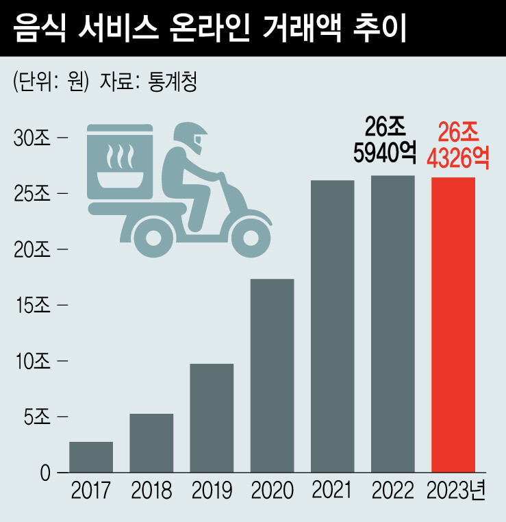
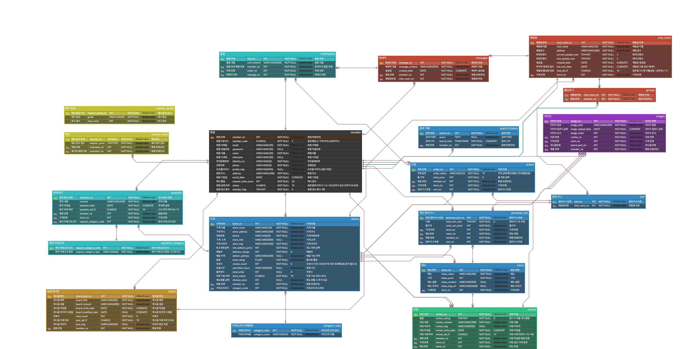

# BobEUM

<div>
<p align="center">
  
</div>

&nbsp;
<div align=center>
	
###  4팀 - NOISE_CAN 
</div>  

## 목차


1. [기술 스택](#기술-스택)
2. [팀원](#팀원)
3. [프로젝트 개요](#프로젝트-개요)  
   3.1. [소개](#소개)     
   3.2.[WBS](#wbs)  
   3.3.[요구사항 명세서](#요구사항-명세서)    
4. [📌 SCHEMA](#-schema)  
   4.1. [MEMBER](#1-member)    
   4.2. [STORES](#2-stores)   
   4.3. [ORDERS](#3-orders)  
5. [✏️ DML](#-dml)  
   5.1. [MEMBER](#1-member-1)  
   5.2. [MENU](#2-menu)  
   5.3. [STORES](#3-stores)  
6. [🧷 프로시저와 트리거](#-프로시저와-트리거)  
   6.1. [PROCEDURE](#procedure)  
   6.2. [TRIGGER](#trigger)

	


## 기술 스택


## 팀원
<div>

|            |      |   |    |
| :------------------------------------------------------------: | :--------------------------------------------------------: | :--------------------------------------------------------: | :------------------------------------------------------: |
|  **최건**<br/>[@gjaku1031](https://github.com/gjaku1031)       |  **이덕찬**<br/>[@deokChan2](https://github.com/deokChan2) |  **임현조**<br/>[@limhyunjo](https://github.com/limhyunjo) |  **홍도현**<br/>[@dh0522](https://github.com/dh0522) |

</div>
<br>

## 프로젝트 개요

### 소개
<p align="center">
<div>
최근 코로나19 팬데믹 이후 배달 서비스의 수요가 크게 증가하였습니다. 하지만 이와 함께 배달 앱 업체들의 높은 수수료 부과로 인해 소비자와 가게 모두에게 부담이 가중되고 있습니다. 소비자들은 배달 수수료 상승으로 인한 경제적 부담을 겪고 있으며, 일부 가게들은 이중 가격제를 도입하는 등 새로운 대응 방안을 모색하고 있습니다.   
</br>
</br>

이러한 배달 서비스의 현안을 해결하기 위해, 저희는 지역 커뮤니티를 기반으로 한 새로운 앱 서비스인 `밥이음`을 제안합니다.
</br> 

`밥이음`은 당근 마켓과 유사한 방식으로 지역 주민들이 모여 공동 주문을 할 수 있는 채팅방 기능을 제공합니다. 채팅방 내에서 사용자들은 실시간으로 대화를 나누며 선호하는 메뉴와 가게를 결정할 수 있습니다. 또한 개별적으로 주문하는 것이 아니라 함께 모아 주문함으로써 배달료를 절감할 수 있습니다.  

</div>


</br>

## 📆 WBS

<div>


[WBS](https://github.com/beyond-sw-camp/be13-1st-bab_eum/blob/main/WBS%204%E1%84%8C%E1%85%A9.pdf)
  


</div>

<div>
</br>

## 📃 요구사항 명세서

    
[요구사항 명세서](https://github.com/beyond-sw-camp/be13-1st-bab_eum/blob/main/%E1%84%8B%E1%85%AD%E1%84%80%E1%85%AE%E1%84%89%E1%85%A1%E1%84%92%E1%85%A1%E1%86%BC%20%E1%84%86%E1%85%A7%E1%86%BC%E1%84%89%E1%85%A6%E1%84%89%E1%85%A5.pdf)


</div>

</br>

## 📈 ERD 


## 📌 SCHEMA 
### 1. MEMBER
```sql
CREATE TABLE `member` (
	`member_no` INT(11) NOT NULL AUTO_INCREMENT,
	`member_code` CHAR(1) NOT NULL DEFAULT '1',
	`email` VARCHAR(100) NOT NULL ,
	`password` VARCHAR(100) NOT NULL ,
	`name` VARCHAR(100) NOT NULL ,
	`nickname` VARCHAR(100) NOT NULL ,
	`identity_no` VARCHAR(20) NOT NULL ,
	`phone` VARCHAR(20) NOT NULL ,
	`profile_img` VARCHAR(900) NULL DEFAULT NULL,
	`address` VARCHAR(1000) NOT NULL ,
	`enroll_date` DATE NOT NULL DEFAULT curdate(),
	`manner_total_score` INT(11) NOT NULL DEFAULT '25' ,
	`status` CHAR(1) NOT NULL DEFAULT 'N' ,
	`member_flag` TINYINT(4) NOT NULL DEFAULT '0' ,
	PRIMARY KEY (`member_no`) USING BTREE,
	CONSTRAINT `CONSTRAINT_1` CHECK (`status` in ('Y','N')),s
	CONSTRAINT `CONSTRAINT_2` CHECK (`member_code` in ('1','2','3')),
	CONSTRAINT `CONSTRAINT_3` CHECK (`status` in ('Y','N')),
	CONSTRAINT `CONSTRAINT_4` CHECK (`member_code` in ('1','2','3'))
);
```

### 2. STORES
```sql
CREATE TABLE `stores` (
	`store_no` INT(11) NOT NULL AUTO_INCREMENT,
	`store_name` VARCHAR(150) NOT NULL,
	`store_address` VARCHAR(1000) NOT NULL ,
	`phone` VARCHAR(20) NOT NULL ,
	`store_info` VARCHAR(3000) NULL DEFAULT NULL,
	`store_img` VARCHAR(1000) NOT NULL ,
	`min_delivery_price` INT(11) NOT NULL,
	`delivery_charge` INT(11) NOT NULL DEFAULT '0' ,
	`deliver_address` VARCHAR(1000) NULL DEFAULT NULL ,
	`total_rating` FLOAT NOT NULL ,
	`review_count` INT(11) NOT NULL DEFAULT '0' ,
	`operation_hours` VARCHAR(300) NULL DEFAULT NULL,
	`total_order` INT(11) NULL DEFAULT '0',
	`store_status` CHAR(1) NOT NULL DEFAULT 'Y' ,
	`member_no` INT(11) NOT NULL,
	`category_code` INT(11) NOT NULL DEFAULT '0',
	PRIMARY KEY (`store_no`) USING BTREE,
	INDEX `FK_member_TO_stores_1` (`member_no`) USING BTREE,
	INDEX `FK_category_TO_stores` (`category_code`) USING BTREE,
	CONSTRAINT `FK_category_TO_stores` FOREIGN KEY (`category_code`) REFERENCES `category_type` (`category_code`) ON UPDATE RESTRICT ON DELETE RESTRICT,
	CONSTRAINT `FK_member_TO_stores_1` FOREIGN KEY (`member_no`) REFERENCES `member` (`member_no`) ON UPDATE RESTRICT ON DELETE RESTRICT,
	CONSTRAINT `CONSTRAINT_1` CHECK (`store_status` in ('Y','N')),
	CONSTRAINT `CONSTRAINT_2` CHECK (`store_status` in ('Y','N'))
);
```

### 3. ORDERS
```sql
CREATE TABLE orders (
	order_no INT(11) NOT NULL AUTO_INCREMENT,
	order_status VARCHAR(10) NOT NULL DEFAULT 'N',
	total_price INT(11) NOT NULL DEFAULT '0' ,
	member_no INT(11) NOT NULL ,
	store_no INT(11) NOT NULL ,
	cart_no INT(11) NOT NULL,
	PRIMARY KEY (order_no) USING BTREE,
	INDEX FK_member_TO_orders_1 (member_no) USING BTREE,
	INDEX FK_cart_TO_orders (cart_no) USING BTREE,
	INDEX FK_store_TO_orders_1 (store_no) USING BTREE,
	CONSTRAINT FK_cart_TO_orders FOREIGN KEY (cart_no) REFERENCES cart (cart_no) ON UPDATE RESTRICT ON DELETE RESTRICT,
	CONSTRAINT FK_member_TO_orders_1 FOREIGN KEY (member_no) REFERENCES member (member_no) ON UPDATE RESTRICT ON DELETE RESTRICT,
	CONSTRAINT FK_stores_TO_orders_1 FOREIGN KEY (store_no) REFERENCES stores (store_no) ON UPDATE RESTRICT ON DELETE RESTRICT,
	CONSTRAINT CONSTRAINT_1 CHECK (order_status in ('Y','N')),
	CONSTRAINT CONSTRAINT_2 CHECK (order_status in ('Y','N'))
);
```

</br>

## ✏️ DML 
### 1. MEMBER
```sql
일반 회원
INSERT INTO `member` 
( member_code, user_id, email, `password`, `name`, nickname,identity_no, phone, profile_img, address,manner_total_score)
VALUES( 
        '1',
        'choi123',
        'choi123@gmail.com',
	'choigun123',
	'최건', 
	'잠수한 악어',
	'778872-1484893',
	'010-2222-3333',
	'C:\Users\Playdata\Documents\프로젝트4조\4조 이미지 폴더\회원 이미지.jpg',
	'서울특별시 동작구 여의대방로36길 36-1',
	0
);

가게용 회원
INSERT INTO `member`
( member_code, user_id, email, `password`, `name`, nickname,identity_no, phone, profile_img, address,manner_total_score)
VALUES(
	'2',
	'jang0312',
	'jang0312@gmail.com',
	'janggun0312',
	'장건',
	'로컬 버드',
	'899003-2484773',
	'010-2222-9969',
	'C:\Users\Playdata\Documents\프로젝트4조\4조 이미지 폴더\가게 프로필 이미지.jpg',
	'서울특별시 동작구 신대방길 80',
	0
);


관리자 회원
INSERT INTO `member`
( member_code, user_id, email, `password`, `name`, nickname,identity_no, phone, profile_img, address,manner_total_score)
VALUES(
	'3',
	'dong123',
	'dong123@gmail.com',
	'donggun123',
	'동건',
	'로컬 휴먼',
	'779003-2484663',
	'010-2222-9969',
	'C:\Users\Playdata\Documents\프로젝트4조\4조 이미지 폴더\관리자 프로필 이미지.jpg',
	'서울특별시 동작구 신대방1다길 24',
	0
);

```

### 2. MENU
```sql
INSERT INTO `menu`
( menu_name, menu_price, menu_content, menu_img_url, store_no )
VALUES (
	'토마토 피자',
	21000,
	'납작한 반죽에 토마토 소스와 치즈 등 토핑을 얹어서 구워낸 토마토피자',
	"C:\Users\g\Documents\1차 프로젝트\메뉴 이미지\pizza.webp",
	1	
);

```

### 3. STORES
```sql
INSERT INTO `stores`
(store_name, store_address, phone, store_info, store_img, min_delivery_price,
delivery_charge, total_rating, review_count, store_status, member_no, category_code)
VALUES(
	'홍킁반점',
	'서울특별시 동작구 보라매로',
	'02-421-1516',
	'둘이 먹다 하나가 죽어도 모르는 맛집',
	'C:\Users\Playdata\Documents\프로젝트4조\4조 이미지 폴더\홍킁반점.jpg'
	15000,
	6000,
	4.2,
	12,
	'Y',
	5,
	2
);
```
</br>

## 🧷 프로시저와 트리거

### PROCEDURE  

```sql
DELIMITER $$
CREATE OR REPLACE PROCEDURE chatRoomEnter(
	IN enterChatRoomNum INT,
	IN enterMemberNum INT
)
BEGIN
	DECLARE chatRoomCurrentNum INT;
	DECLARE chatRoomMaxNum INT;
	
	SET chatRoomCurrentNum = 
		(SELECT current_people_num
		FROM chat_room
		WHERE chat_room_no = enterChatRoomNum
		)
		;
	SET chatRoomMaxNum = 
		(SELECT max_people_num
		FROM chat_room
		WHERE chat_room_no = enterChatRoomNum
		)
		;
	IF 
		chatRoomCurrentNum < chatRoomMaxNum
	THEN 
		INSERT INTO `groups`(chat_room_no, member_no)
		VALUES (enterChatRoomNum, enterMemberNum)
		;
		UPDATE chat_room
      SET current_people_num = current_people_num + 1
      WHERE chat_room_no = enterChatRoomNum
		;
	END IF;
END$$
DELIMITER ;

```

```sql
DELIMITER $$
CREATE OR REPLACE PROCEDURE insertMannerLevel(
    IN p_manner_score TINYINT,
    IN p_evaluatee_no INT,
    IN p_evaluator_no INT
)
BEGIN
    INSERT INTO manner_level (manner_score, evaluatee_no, evaluator_no)
    VALUES (p_manner_score, p_evaluatee_no, p_evaluator_no)
	 ;
END$$
DELIMITER ;
```
```sql
DELIMITER $$
CREATE PROCEDURE CreatePersonalCart(
    IN p_member_no INT,
    IN p_menu_name VARCHAR(255),
    IN p_quantity INT,
    IN p_cart_no INT
)
BEGIN
    INSERT INTO personal_cart (total_cart_num,
                               store_no,
                               menu_no,
                               member_no,
                               cart_no,
                               total_cart_price)
    SELECT
        p_quantity
        m.store_no, 
        m.menu_no, 
        p_member_no
        p_cart_no
        p_quantity * m.menu_price
    FROM menu m
    WHERE m.menu_name = p_menu_name;
END$$
DELIMITER ;

```
```sql
DELIMITER $$

CREATE PROCEDURE InsertChatRoom(
    IN chat_name VARCHAR(255), 
    IN address VARCHAR(255), 
    IN max_people_num INT, 
    IN store_no INT
)
BEGIN
    INSERT INTO chat_room (chat_name, address, max_people_num, store_no)
    VALUES (chat_name, address, max_people_num, store_no);
END$$

DELIMITER ;
```

### TRIGGER
```sql
DELIMITER $$

CREATE OR REPLACE TRIGGER updateMemberAfterMannerInsert
AFTER INSERT ON manner_level
FOR EACH ROW
BEGIN
    UPDATE `member`
    SET manner_total_score = manner_total_score + NEW.manner_score
    WHERE member_no = NEW.evaluatee_no;
END$$

DELIMITER ;
```

```sql
DELIMITER $$

CREATE OR REPLACE TRIGGER afterChatRoomInsert
AFTER INSERT ON chat_room
FOR EACH ROW
BEGIN
    INSERT INTO cart(chat_room_no) VALUES (NEW.chat_room_no);
END$$

DELIMITER ;
```
